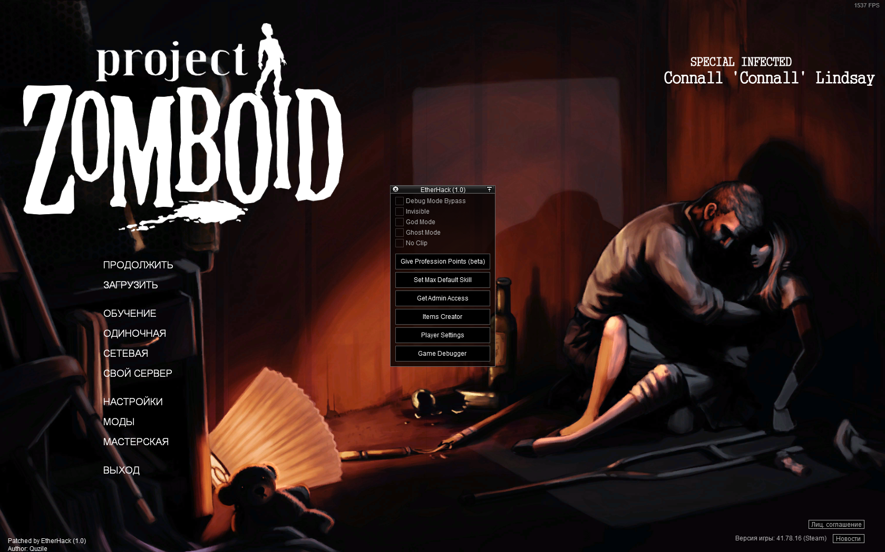
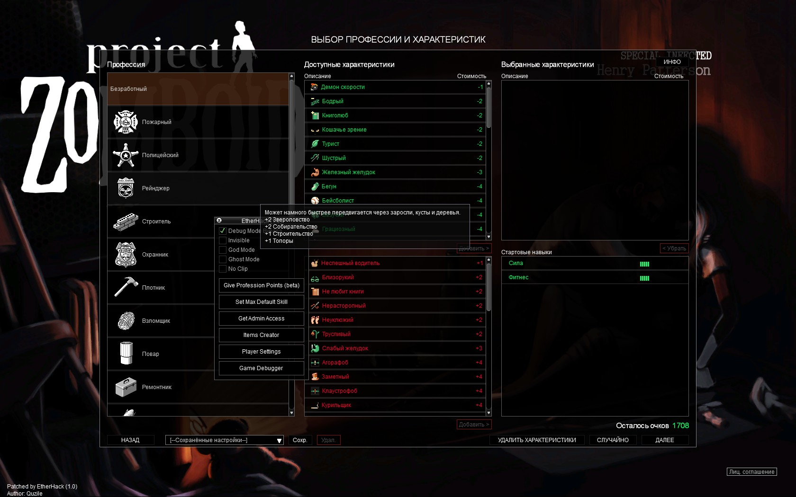
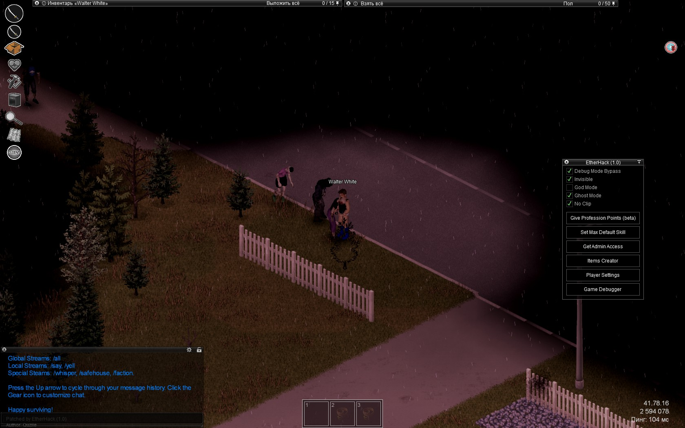
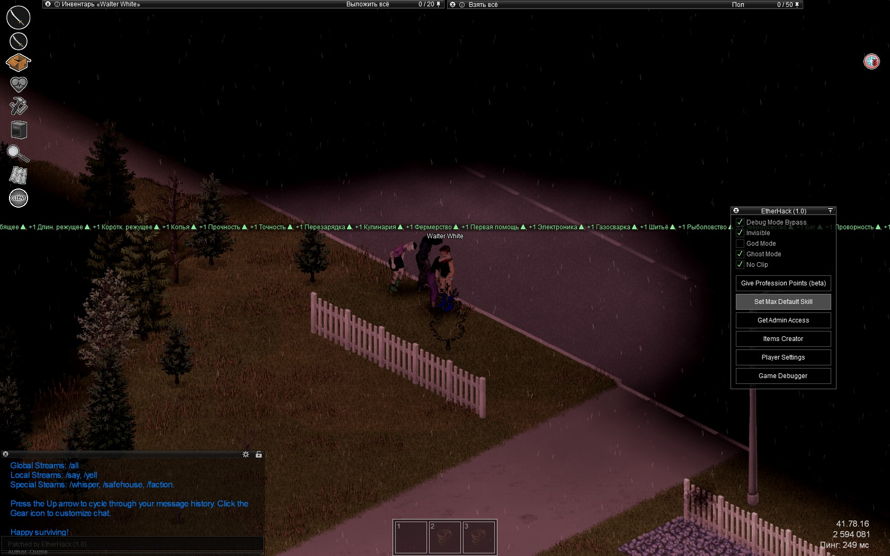
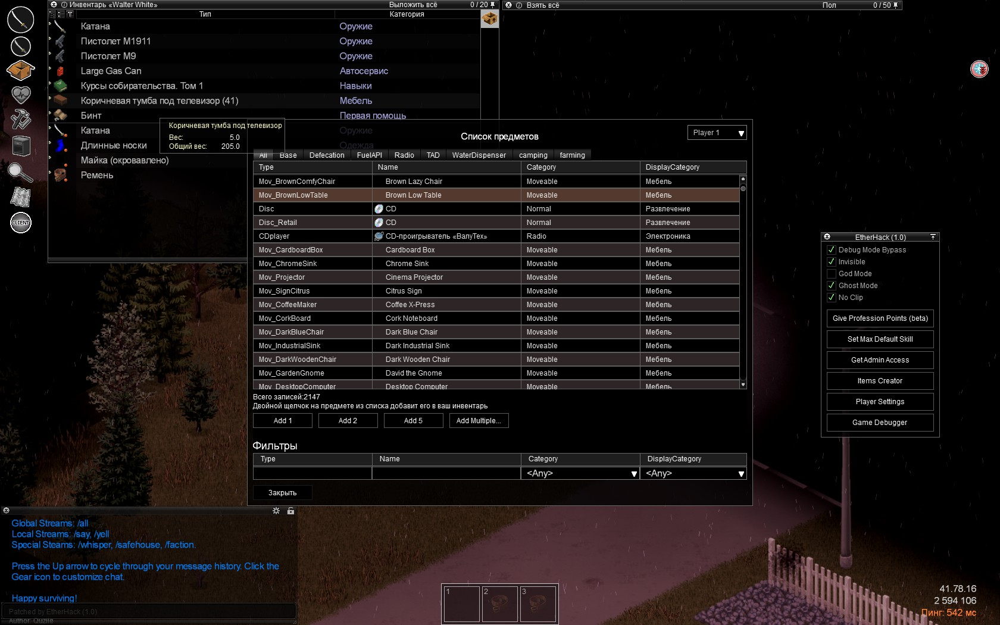
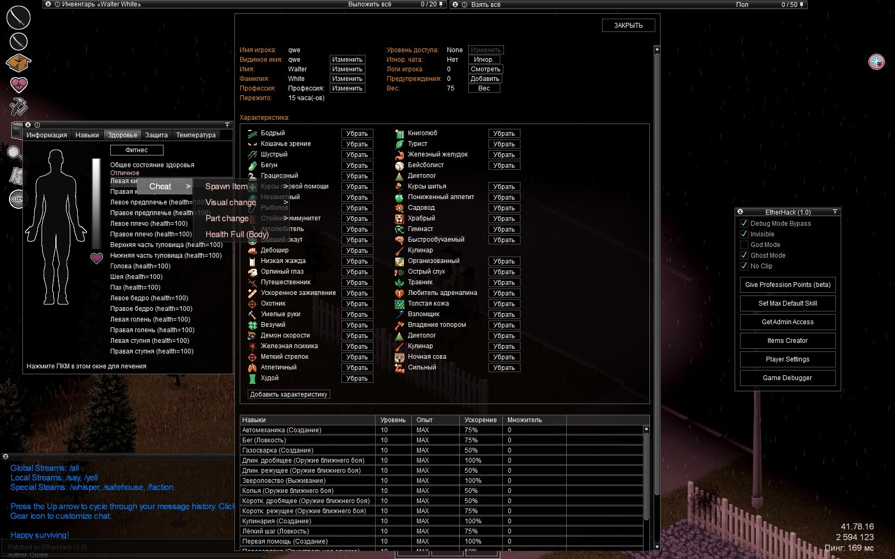
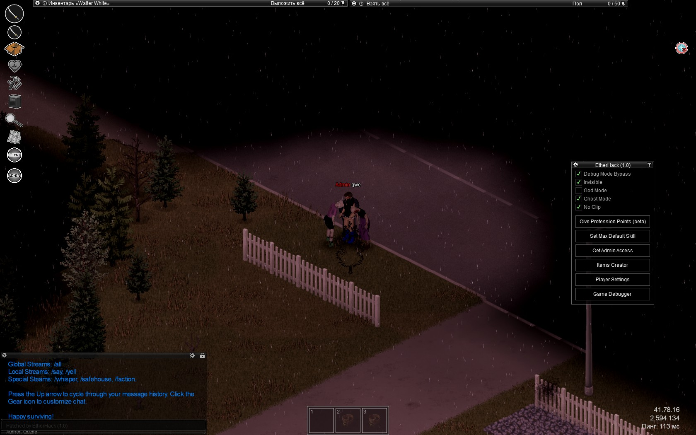

<h1 align="center">Project-Zomboid-EtherHack</h1>
<p align="center">
  
  
  
  
  
</p>

This is a cheat written in Java(API) and LUA(GUI) for Project Zomboid. It is aimed at providing the game with additional functionality that allows users to get some benefits. Please use responsibly and understand the consequences that may arise as a result of improper use.
The performance of the cheat was tested on the latest version of the game `41.78.16 (Steam)` (July 05, 2023).

## Table of Contents
- [Cheat functionality](#cheat-functionality)
- [Demo](#demo)
- [Getting Started](#getting-started)
- [Prerequisites](#prerequisites)
- [Installation](#installation)
- [Uninstallation](#uninstallation)
- [Usage](#usage)
- [For developer](#for-developer)
- [Contributing](#contributing)
- [Disclaimer](#disclaimer)
- [License](#license)
- [Contact](#contact)

## Cheat functionality

| Function                    |        Working in multiplayer        | Working in a co-op  | Description                                                                                                                                                                                                                                                    |
|-----------------------------|:------------------------------------:|:-------------------:|----------------------------------------------------------------------------------------------------------------------------------------------------------------------------------------------------------------------------------------------------------------|
| Debug Mode Bypass           |                  +                   |          +          | Allows you to use the developer mode in multiplayer (when starting the game with -debug connection is not possible). When you click the right mouse button, additional menus appear, including changing clothes, repairing cars, teleporting on the map, etc.  |
| Invisible                   |                  +                   |          +          | Allows you to become invisible to everyone                                                                                                                                                                                                                     |
| God Mode                    |                  +                   |          +          | Gives immortality to the character                                                                                                                                                                                                                             |
| Ghost Mode                  |                  +                   |          +          | Invisibility for zombies                                                                                                                                                                                                                                       |
| No Clip                     |                  +                   |          +          | Ability to pass through walls and objects                                                                                                                                                                                                                      |
| Give Profession Point(beta) | -/+<span style="color:red;">*</span> |          +          | Adds +100 points to the character creation menu                                                                                                                                                                                                                |
| Set Max Default Skill       |                  +                   |          +          | Sets the character's standard skills to the maximum level                                                                                                                                                                                                      |
| Get Admin Access            | -<span style="color:red;">**</span>  |          +          | Obtaining administrator rights on the server                                                                                                                                                                                                                   |
| Items Creator               |                  +                   |          +          | The item creation menu, the ability to sort, search, etc.                                                                                                                                                                                                      |
| Player Editor               |                  +                   |          +          | The character editing menu, the ability to add skills, perks, etc.                                                                                                                                                                                             |
| Game Debug Menu             | -<span style="color:red;">**</span>  |          +          | Debugging menu, includes setting the local time, etc.                                                                                                                                                                                                          |

<span style="color:red;">*</span> - It only works when creating a character from the main menu, that is, points will not be added to the menu after death. Solution: after death, log out of the server and connect again.

<span style="color:red;">**</span> - It works only if some types of anti-cheats are disabled on the server, for example, type 12 will allow you to get administrator rights. As a rule, anti-cheat is disabled on servers with mods

## Demo








## Getting Started

This section will provide information on how to get a local copy of the project up and running.

### Prerequisites

This tool requires:

-   [Java 17](https://www.oracle.com/java/technologies/downloads/) or newer
-   Steam copy of [Project Zomboid](https://store.steampowered.com/app/108600/Project_Zomboid/)

### Installation

1. Download and install Java on your computer
2. Make sure that the path to Java is set in your environment variables (For Windows: `WIN + X -> "System" -> "Advanced System Parameters" -> "Environment Variables" -> Double click on "Path" -> Insert path to java, for example "C:\Program Files\Java\jre-1.8\bin"`)
3. Clone the repository
4. Open the project in the IDE and build the executable via Gradle `.jar` file
5. Move the created `.jar` to the root folder of the game (For example, `c:\Steam\steamapps\common\ProjectZomboid`)
6. Open the console in the root folder and run the following command: `java -jar ./EtherHack-{VERSION}.jar --install`

`{VERSION}` - Specify your version of the cheat

### Uninstallation
Open the console in the root folder and run the following command: `java -jar ./EtherHack-{VERSION}.jar --uninstall`

`{VERSION}` - Specify your version of the cheat

## Usage

After successfully installing the cheat, you need to log in to the game. When loading, no additional labels will appear, however, in the game itself (menu and in the game session) it will be in the lower left corner. The names of the game window will also change.

To open the cheat menu, press the `Insert` key

## For developer
If you are a developer and want to expand the functionality, you can do it as follows:

In the project folder located on the path `src/main/resources/EtherHack/lua` there is a single file responsible for rendering the entire user interface of the cheat. You can edit it using examples from game files.

Also, Eterhack provides the ability to add custom methods from Java to lua, for this in the `src/main/java/EtherHack/Ether/EtherAPI.java` needs to find the `public static class GlobalEtherAPI` and add it according to the available examples:

```java
@LuaMethod(
         name = "yourMethodName",
        global = true
)
public static String yourMethodName() {
    return "Test!";
}
```
After adding and reassembling the cheat, you will be able to call this method in lua:

```lua
print(yourMethodName());
--Output log: Test!
```

## Contributing

We welcome contributions from the community. If you want to contribute, please fork the repository and create a pull request with your changes.

## Disclaimer

This software is provided 'as-is', without any express or implied warranty. In no event will the author be held liable for any damages arising from the use of this software. Use of this software may also violate the terms of service of the game and could lead to your account being banned. Use at your own risk.

## License

This project is under `MIT License` - see the LICENSE file for details.

## Contact

If you have any questions, feel free to reach out to me at `rubranny@gmail.com`
